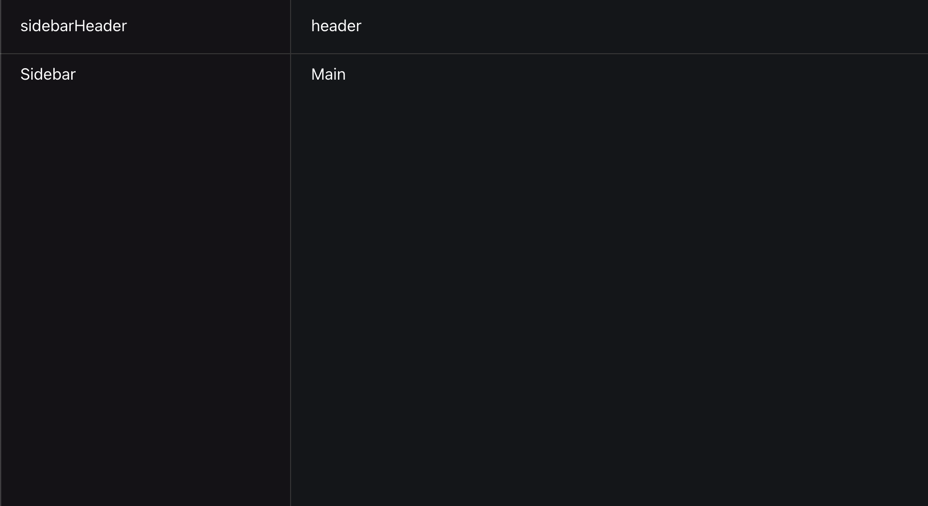
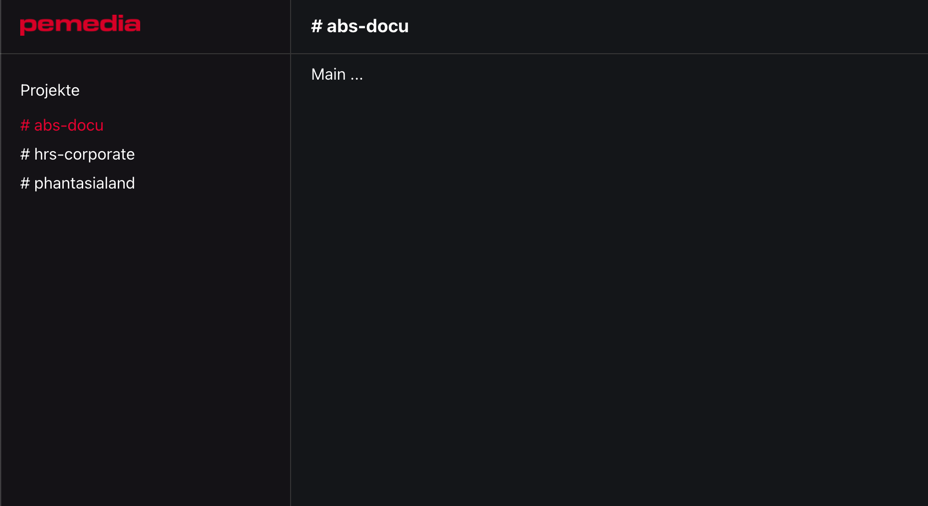

[README](../README.md)

[< prev](3_Chapter_States.md)

## Layout

We don't use sass, or styled-components, but simple CSS modules.

Let's create some CSS variables inside `index.css`:

```css
:root {
    --color-bg-dark2: #19171c;
    --color-bg-dark1: #1b1d21;
    --color-gray-dark1: #444444;
    --color-text-on-dark: #8f8f8f;
    --color-primary: #ed1a3d;
}
```

Then we divide our App into 4 sections:

-   top left: `<div class={styles.sidebarHeader}>`
-   top right: `<header class={styles.header}>`
-   bottom left: `<nav class={styles.sidebar}>`
-   bottom right: `<main class={styles.main}>`



Let's use a CSS Grid for it. With:

```css
.main {
    display: grid;
    grid-template-columns: 290px 1fr;
    grid-template-rows: 56px 1fr;
    /* ... */
}
```

For the borders between the sections, we use a background color, and give the grid a `grid-gap`:

```css
.main {
    /* ... */
    background-color: var(--color-gray-dark1);
    grid-gap: 1px;
    color: white;
}
```

and the other styles ....

### F\*\*\* CSS!

Ok, just copy `_workshop-assets/4_chapter/App.module.css` into your `src/` folder

### List projects

-   create an array of projects
-   Loop through and create Links

```html
<For each="{projects}">
    {(project) => (
    <a> # {project} </a>
    )}
</For>
```

Why is it not like in React: `{projects.map()}`?

> [...] without a Virtual DOM, naive use of things like Array.prototype.map would wastefully recreate all the DOM nodes on every update. Instead it is common for Reactive libraries to use template helpers. In Solid we wrap them in components.

Source: https://www.solidjs.com/tutorial/flow_show

Docs: about `<For>`: https://www.solidjs.com/docs/latest/api#%3Cfor%3E

**Task**:

-   the first project should initially be selected
-   the selected project should get the CSS class `styles.selected`
-   when you click on another project, that project should get selected

**Task**

-   copy `pemedia.png` from `_workshop-assets/` into your `assets/` folder
-   place the Pemedia Logo in the `sidebarHeader`
-   show the current selected project in the `header` as `<h1>` with an "# " as prefix

Hint:

```tsx
import logo from './assets/pemedia.png';

// ...

;
```

Now it should look like this:



### Jump to solution

> `git checkout chapter-layout`

[next >](5_Chapter_Components.md)
