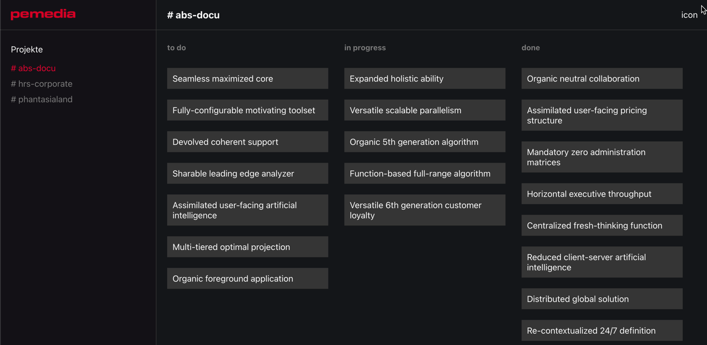

[README](../README.md)

[< prev](6_Chapter_Routing.md)

## Data

Let's create some models (interfaces, types, and classes)...

-   add folder `src/models`
-   `ticket.ts`: interface with id, title, description, assignee, column, project
-   `column.ts`: union type for different possible column names
-   `project`: interface with id, slug, columns
-   `user.ts`: class with id, username, gender and icon
    -   as icon we use the HTTP-API [DiceBear Avatars](https://avatars.dicebear.com/docs/http-api)
    -   this is why we want to store the gender `male`|`female`|`human`, in order to get a fitting avatar icon

### Replace projects.json

-   Normally all data would come from an API, but we won't cover API's in this workshop
-   Let's use our types and write the data type-safe in .ts files instead of .json files

src/data/projects.ts:

```ts
export const projects: Project[] = [
    {
        id: 1,
        slug: 'abs-docu',
        columns: ['to do', 'in progress', 'done'],
    },
    // ...
];
```

**Task**:

-   additional to `projects.ts` create `users.ts` and `tickets.ts`

### Tip to generate a lot of data

-   use the library [Faker](https://fakerjs.dev/):

```ts
import { faker } from '@faker-js/faker';
import { Ticket } from '../models/ticket';
import { users } from './users';
import { projects } from './projects';

export const tickets: Ticket[] = [];

const amountTickets = 30;
for (let i = 0; i < amountTickets; i++) {
    const project = faker.random.arrayElement(projects);
    tickets.push({
        id: i,
        title: faker.company.catchPhrase(),
        description: faker.hacker.phrase(),
        project,
        assignee: faker.random.arrayElement(users),
        column: faker.random.arrayElement(project.columns),
    });
}
```

### Dynamic import of ts files (data)

-   replace `projects.json` with the `projects.ts`
-   instead of fetching json files, we can dynamically (lazy) import .ts files in `store.ts`:

```ts
export const [projects] = createResource<Project[]>(
    () => import('./data/projects').then((res) => res.projects),
    {
        initialValue: [],
    }
);
```

### Display tickets in columns

-   modify `project.tsx`
    -   iterate through `selectedProject().columns` and render `ProjectColumn` and pass `columns` and `tickets` as props
-   create a component `ProjectColumn`
    -   display the column name as title
    -   iterate through the tickets and render them (just `ticket.title` in a div is fine for now)

**Tips**

-   just copy the css files from `/_workshop-assets/7_chapter`
-   you should only pass the tickets for this column to `ProjectColumn`
    -   a good way to do this: create a computed value. [createMemo or a simple derived value](https://www.solidjs.com/docs/latest#creatememo) can be used.

It should look like this now:



### Jump to solution

> `git checkout chapter-data`

---

## What's Next?

It's up to us what we want to do

Ideas

-   Implement a design for the tickets (maybe with popup)
-   Drag & Drop (might take a while)
-   More store logic (filtering, creating, ...) (maybe use of createStore)
-   [Differences to React](Differences_To_React.md)
-   Implement or read about some cool Solid Features
    -   Custom directives. For example `<div class="modal" use:clickOutside={() => setShow(false)}>`
    -   createStore
    -   ErrorBoundary
    -   Suspense & Lazy
-   [Official SolidJS Tutorial](https://www.solidjs.com/tutorial/introduction_basics)
